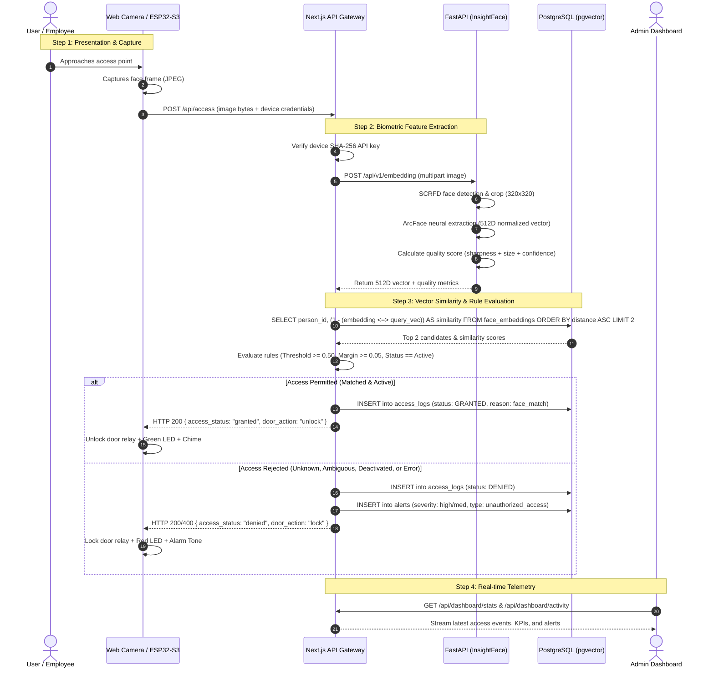
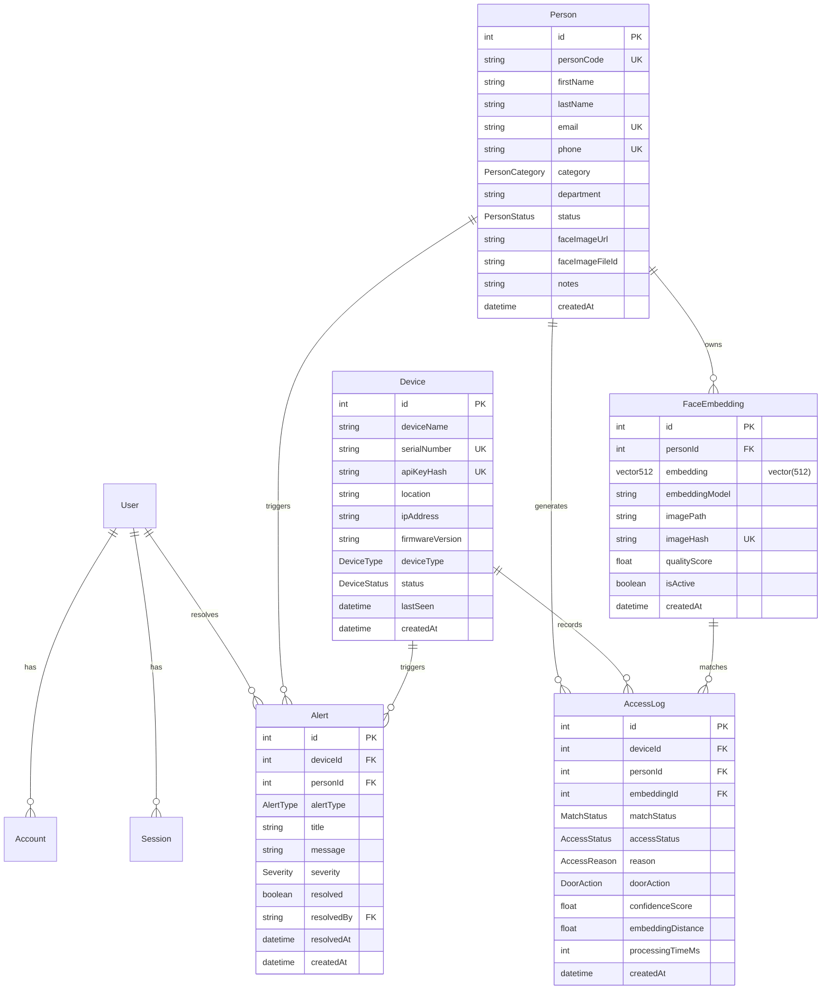

# Comprehensive Project Analysis: IntelliGuard
**AI-Powered Intelligent Access Control & Security Monitoring System**

* **Author / Project Creator:** Michael Umoize (Computer Engineering Student, AI & Machine Learning Enthusiast)  
* **Repository Path:** `c:/Users/Michael Umoize/Desktop/Learning AI-ML/IntelliGuard`  
* **Analysis Date:** October 10, 2026  
* **System Version:** `v1.0.0-development`  
* **Document Objective:** Comprehensive, technically rigorous, code-grounded architectural and functional briefing designed to give another AI assistant complete context to suggest impactful improvements, library replacements, architectural optimizations, and research extensions.

---

## 1. Executive Summary

**IntelliGuard** is a full-stack, AI-driven physical access control, identity verification, and security telemetry system designed as a final-year computer engineering university capstone project. The platform bridges **deep learning computer vision (InsightFace)**, **relational database vector search (`pgvector` in PostgreSQL via Neon)**, a **modern web application gateway (Next.js 16 with React 19 and Prisma ORM)**, and **IoT embedded hardware endpoints (ESP32-S3 CAM with OV5640)**.

The system's core mechanism operates on biometric identity verification: an image captured at an access point (currently simulated via a web camera terminal, with designed HTTP API protocols for ESP32-S3 microcontroller endpoints) is transmitted to the Next.js API layer. Next.js dispatches the image buffer to a dedicated stateless Python microservice built with **FastAPI**, which executes single-face detection (SCRFD) and facial feature representation extraction (**512-dimensional L2-normalized ArcFace embedding vectors**) using **InsightFace** on **ONNX Runtime**. 

The generated 512D float vector is returned to Next.js, which queries PostgreSQL directly using native `pgvector` cosine similarity (`<=>` operator) against active enrolled identities. A deterministic rule-based access engine evaluates the similarity score against strict confidence thresholds and candidate ambiguity margins, checks user activation status and edge device credentials (SHA-256 hashed API keys with constant-time equality checks), and makes a fail-closed access decision (`GRANTED` with relay unlock vs. `DENIED` with relay lock). All events, audit logs, and security alerts (such as unknown faces, ambiguous recognitions, or deactivated personnel access attempts) are persisted to PostgreSQL and streamed to an administrative web interface featuring real-time Web Audio API synthesized chimes and data visualizations.

---

## 2. Project Background and Purpose

Physical access control in modern institutions (commercial offices, university research laboratories, server rooms, and residential complexes) predominantly relies on physical keycards (RFID/NFC), numeric keypad PINs, or basic biometric scanners. These legacy approaches suffer from critical vulnerabilities:
1. **Credential Theft and Sharing:** RFID fobs and PIN codes can be stolen, shared, cloned, or lost.
2. **Siloed Edge Hardware:** Traditional standalone biometric terminals have isolated proprietary firmware with opaque storage, making centralized telemetry, auditing, and multi-door rule enforcement difficult.
3. **Heavy Edge Processing Constraints:** Attempting full deep learning inference on battery- or low-cost microcontrollers leads to severe bottlenecks, high unit costs, and slow recognition.

IntelliGuard addresses these challenges by employing an **asymmetric edge-cloud architecture**:
- **Constrained IoT Edge (ESP32-S3):** Acts solely as a motion-sensing (HC-SR501 PIR), image-capturing (OV5640), and local actuation/feedback node (relay door lock, RGB status LED, active buzzer, OLED status display).
- **Stateless AI Microservice (FastAPI + ONNX Runtime):** Specializes exclusively in tensor manipulation, image decoding, face cropping, landmark detection, and ArcFace feature extraction.
- **Centralized Gateway & Controller (Next.js App Router):** Centralizes authentication, business rules, authorization policies, vector similarity queries, audit persistence, device key rotation, and administration.
- **Enterprise Vector Persistence (PostgreSQL + pgvector):** Retains biometric profiles as first-class `vector(512)` types indexed for fast cosine distance calculation.

---

## 3. Problem Statement and Objectives

### Problem Statement
Standard electronic access control systems cannot reliably prevent identity spoofing while remaining scalable, auditable, and cost-effective. Furthermore, embedded AI systems frequently falter when developers attempt to run heavy neural networks directly on edge microcontrollers or tightly couple biometric inference with web application servers.

### Documented Project Objectives
As defined in [README.md](file:///c:/Users/Michael%20Umoize/Desktop/Learning%20AI-ML/IntelliGuard/README.md) and [ARCHITECTURE.md](file:///c:/Users/Michael%20Umoize/Desktop/Learning%20AI-ML/IntelliGuard/ARCHITECTURE.md):
1. **AI Face Recognition Pipeline:** Build an accurate biometric pipeline extracting 512D ArcFace embeddings with composite image quality validation (sharpness, resolution, and detection confidence).
2. **PostgreSQL Vector Persistence:** Store and search biometric embeddings directly in PostgreSQL using `pgvector` cosine similarity (`<=>`).
3. **Fail-Closed Access Control Engine:** Implement deterministic security rules evaluating similarity thresholds, ambiguity margins between competing candidates, and user deactivation states.
4. **Edge Hardware Integration Architecture:** Define secure device authentication mechanisms (SHA-256 hashed API keys) for ESP32-S3 CAM hardware controlling physical door relays.
5. **Real-Time Administrative Dashboard:** Deliver telemetry for door events, KPI metrics, system health probes, and unresolved security alerts.
6. **Webcam Simulation for Development:** Provide a live browser-based webcam simulation terminal with audio feedback to validate end-to-end recognition prior to physical hardware field deployment.
7. **Empirical Benchmarking & Evaluation:** Measure end-to-end latency ($T_{\text{total}} = T_{\text{capture}} + T_{\text{upload}} + T_{\text{inference}} + T_{\text{search}} + T_{\text{actuation}}$), memory consumption, and biometric accuracy (FAR/FRR).

---

## 4. Target Users and Use Cases

### Target Users
1. **Security Administrators:** Manage system configuration, register personnel, monitor door telemetry, review audit trails, and resolve security alerts.
2. **Authorized Personnel (Employees, Students, Contractors):** Gain seamless, hands-free door unlocking by approaching registered camera endpoints.
3. **Academic Evaluators and Engineers:** Review the integration of AI, database systems, distributed microservices, and embedded hardware for final-year engineering defense.

### Primary Use Cases
1. **Personnel Enrollment & Biometric Registration:** Administrator inputs personnel metadata, captures/uploads a facial portrait, validates biometric quality via real-time prechecks, detects duplicate faces across existing profiles, uploads the raw image to ImageKit CDN, and writes the `vector(512)` record to PostgreSQL.
2. **Live Access Verification (Webcam or ESP32):** A person presents their face; the frame is processed by FastAPI and pgvector; if similarity $\ge 0.50$ and margin $\ge 0.05$, access is granted, the door lock relay actuates, and a green chime sounds.
3. **Intrusion & Anomaly Auditing:** An unrecognized face triggers a `DENIED` decision, logs an `AccessLog` entry (`reason: face_no_match`), and raises a medium-severity `Alert` (`unknown_face`). A deactivated employee attempting access raises a high-severity `Alert`.
4. **IoT Device Provisioning & Revocation:** Admin registers a new ESP32-S3 terminal, receives a secure cryptographic API key (`ig_dev_...`), updates door locations, monitors last-seen heartbeats, or regenerates keys to revoke compromised terminals.

---

## 5. Complete Feature Breakdown

### 5.1 Biometric Enrollment & Quality Precheck
* **What it does:** Enrolls individuals into the database with validated biometric vectors. Includes a live client-side precheck that evaluates image quality prior to form submission.
* **Implementation:**
  * Endpoint: [`POST /api/persons`](file:///c:/Users/Michael%20Umoize/Desktop/Learning%20AI-ML/IntelliGuard/frontend/app/api/persons/route.ts#L14-L225)
  * Precheck Endpoint: [`POST /api/persons/precheck`](file:///c:/Users/Michael%20Umoize/Desktop/Learning%20AI-ML/IntelliGuard/frontend/app/api/persons/precheck/route.ts#L7-L83)
  * Form UI: [`register-form.tsx`](file:///c:/Users/Michael%20Umoize/Desktop/Learning%20AI-ML/IntelliGuard/frontend/app/dashboard/persons/register/register-form.tsx)
  * Webcam Capture Modal: [`webcam-capture-modal.tsx`](file:///c:/Users/Michael%20Umoize/Desktop/Learning%20AI-ML/IntelliGuard/frontend/components/ai/webcam-capture-modal.tsx)
* **Key Mechanisms:**
  * Enforces single-face presence (rejects zero faces or multiple faces with HTTP 400).
  * Runs [`checkForDuplicateFace`](file:///c:/Users/Michael%20Umoize/Desktop/Learning%20AI-ML/IntelliGuard/frontend/lib/ai/duplicate-check.ts#L19-L100) using pgvector at an 85% cosine similarity threshold to prevent duplicate enrollments under different names.
  * Uploads original portraits to ImageKit cloud storage (`/intelliguard/persons/`).
  * Executes an atomic database transaction via Prisma; if the DB write fails, it executes an automated compensating rollback to delete the uploaded ImageKit asset ([`deleteFaceImage`](file:///c:/Users/Michael%20Umoize/Desktop/Learning%20AI-ML/IntelliGuard/frontend/lib/ai/imagekit.ts#L102-L112)).
* **Status:** Complete and fully verified with integration tests.

### 5.2 Face Replacement & Biometric Re-enrollment
* **What it does:** Allows administrators to update a person's biometric portrait without losing historical records.
* **Implementation:** [`POST /api/persons/[id]/face`](file:///c:/Users/Michael%20Umoize/Desktop/Learning%20AI-ML/IntelliGuard/frontend/app/api/persons/%5Bid%5D/face/route.ts#L10-L194) and [`replace-face-modal.tsx`](file:///c:/Users/Michael%20Umoize/Desktop/Learning%20AI-ML/IntelliGuard/frontend/components/ai/replace-face-modal.tsx).
* **Key Mechanisms:**
  * Runs duplicate detection excluding the person's own ID (`excludePersonId`).
  * Deactivates older `FaceEmbedding` records (`isActive: false`) and inserts the new active vector.
  * Deletes the old ImageKit asset post-commit.
* **Status:** Complete.

### 5.3 Core Access Control & Recognition Engine
* **What it does:** Ingests captured frames, runs AI inference, performs vector search, evaluates business rules, and outputs door unlock commands.
* **Implementation:**
  * Route Handler: [`POST /api/access`](file:///c:/Users/Michael%20Umoize/Desktop/Learning%20AI-ML/IntelliGuard/frontend/app/api/access/route.ts#L11-L287)
  * Vector Search: [`findTopFaceMatches`](file:///c:/Users/Michael%20Umoize/Desktop/Learning%20AI-ML/IntelliGuard/frontend/lib/ai/face-recognition.ts#L50-L214)
  * Rule Engine: [`evaluateAccess`](file:///c:/Users/Michael%20Umoize/Desktop/Learning%20AI-ML/IntelliGuard/frontend/lib/access/access-control.ts#L41-L106)
* **Access Rules:**
  * **Rule 1 (Matched):** `matchStatus === "matched"`, person `status === "active"`, and `similarity >= FACE_MATCH_THRESHOLD` (default: 0.50) $\rightarrow$ `GRANTED`, `doorAction: "unlock"`.
  * **Rule 2 (Unknown):** Best candidate similarity $< 0.50 \rightarrow$ `DENIED`, `doorAction: "lock"`, creates `unknown_face` Alert.
  * **Rule 3 (Ambiguous):** Top two candidates have difference $< \text{FACE\_AMBIGUITY\_MARGIN}$ (default: 0.05) $\rightarrow$ `DENIED`, creates `unauthorized_access` Alert.
  * **Rule 4 (Deactivated/Suspended User):** Face matches a registered profile, but `status !== "active"` $\rightarrow$ `DENIED`, creates high-severity `unauthorized_access` Alert ("Access Denied - Deactivated User").
  * **Rule 5 (Fail-Closed Default):** AI service timeout, database outage, or invalid payload $\rightarrow$ `DENIED`, `doorAction: "lock"`, creates high-severity `system_error` Alert.
* **Biometric Privacy Safeguard:** Zero raw 512D float arrays are ever leaked into client HTTP responses or public logs.
* **Status:** Complete.

### 5.4 Live Webcam Simulation Terminal
* **What it does:** Browser-based biometric terminal for desktop testing without physical ESP32 hardware.
* **Implementation:** [`app/dashboard/simulation/page.tsx`](file:///c:/Users/Michael%20Umoize/Desktop/Learning%20AI-ML/IntelliGuard/frontend/app/dashboard/simulation/page.tsx), [`live-camera-preview.tsx`](file:///c:/Users/Michael%20Umoize/Desktop/Learning%20AI-ML/IntelliGuard/frontend/components/ai/live-camera-preview.tsx), [`access-result-card.tsx`](file:///c:/Users/Michael%20Umoize/Desktop/Learning%20AI-ML/IntelliGuard/frontend/components/ai/access-result-card.tsx), and [`audio.ts`](file:///c:/Users/Michael%20Umoize/Desktop/Learning%20AI-ML/IntelliGuard/frontend/lib/audio.ts).
* **Key Features:**
  * Canvas-rendered futuristic scanning HUD overlay with animated scanline.
  * Single-scan or automated continuous monitoring loop (2.5s interval).
  * Stale-response and in-flight request guards to prevent race conditions during rapid face movements.
  * Native Web Audio API sound synthesis (D5 $\rightarrow$ A5 harmonic chime for granted; descending sawtooth buzzer for denied).
  * Side-by-side verification card comparing live captured frame against enrolled cloud avatar.
  * Local session history log of the last 10 scans.
* **Status:** Complete.

### 5.5 IoT Device Management & Authentication
* **What it does:** Registers, manages, and authenticates edge camera terminals and door controllers.
* **Implementation:**
  * API Routes: [`app/api/devices/route.ts`](file:///c:/Users/Michael%20Umoize/Desktop/Learning%20AI-ML/IntelliGuard/frontend/app/api/devices/route.ts), [`app/api/devices/[id]/route.ts`](file:///c:/Users/Michael%20Umoize/Desktop/Learning%20AI-ML/IntelliGuard/frontend/app/api/devices/%5Bid%5D/route.ts), and [`app/api/devices/[id]/regenerate-key/route.ts`](file:///c:/Users/Michael%20Umoize/Desktop/Learning%20AI-ML/IntelliGuard/frontend/app/api/devices/%5Bid%5D/regenerate-key/route.ts)
  * Authentication Helper: [`device-auth.ts`](file:///c:/Users/Michael%20Umoize/Desktop/Learning%20AI-ML/IntelliGuard/frontend/lib/access/device-auth.ts)
  * UI: [`app/dashboard/devices/page.tsx`](file:///c:/Users/Michael%20Umoize/Desktop/Learning%20AI-ML/IntelliGuard/frontend/app/dashboard/devices/page.tsx) and [`app/dashboard/devices/[id]/page.tsx`](file:///c:/Users/Michael%20Umoize/Desktop/Learning%20AI-ML/IntelliGuard/frontend/app/dashboard/devices/%5Bid%5D/page.tsx)
* **Security Design:**
  * Generates 24-byte cryptographically secure random API keys prefixed with `ig_dev_`.
  * Computes SHA-256 hash; stores only `apiKeyHash` in PostgreSQL; plaintext key is displayed once in modal.
  * Authentication uses `crypto.timingSafeEqual` to eliminate timing side-channel attacks.
  * Immediate revocation of previous keys upon regeneration.
  * Preserves historical access logs and alerts when a device is deleted (`onDelete: SetNull`).
* **Status:** Complete for backend API and admin dashboard; physical ESP32 firmware remains to be connected.

### 5.6 Security Telemetry, Dashboard Analytics, & Health Probes
* **What it does:** Displays real-time KPIs, recognition breakdowns, activity timelines, and microservice health checks.
* **Implementation:**
  * Main Dashboard: [`app/dashboard/page.tsx`](file:///c:/Users/Michael%20Umoize/Desktop/Learning%20AI-ML/IntelliGuard/frontend/app/dashboard/page.tsx)
  * Stats API: [`GET /api/dashboard/stats`](file:///c:/Users/Michael%20Umoize/Desktop/Learning%20AI-ML/IntelliGuard/frontend/app/api/dashboard/stats/route.ts)
  * Health Probe API: [`GET /api/dashboard/health`](file:///c:/Users/Michael%20Umoize/Desktop/Learning%20AI-ML/IntelliGuard/frontend/app/api/dashboard/health/route.ts)
  * Event Activity API: [`GET /api/dashboard/activity`](file:///c:/Users/Michael%20Umoize/Desktop/Learning%20AI-ML/IntelliGuard/frontend/app/api/dashboard/activity/route.ts)
* **Key Components:**
  * 6 KPI cards (Total registered, active personnel, today's attempts, today's granted, today's denied, active alerts).
  * Recharts area chart breaking down today's access attempts into 4-hour time slots.
  * Recognition accuracy breakdown (matched %, unknown %, ambiguous %, average quality %, average latency).
  * System Health Panel checking Next.js, FastAPI `/api/v1/health`, PostgreSQL connection, `pgvector` extension availability, and ImageKit credentials with a 5-minute in-memory cache and `?force=true` bypass.
* **Status:** Complete.

### 5.7 Audit Logs & Security Alerts Center
* **What it does:** Provides queryable, filterable access audit records and actionable security alert management.
* **Implementation:**
  * Access Logs Page: [`app/dashboard/access-logs/page.tsx`](file:///c:/Users/Michael%20Umoize/Desktop/Learning%20AI-ML/IntelliGuard/frontend/app/dashboard/access-logs/page.tsx)
  * Access Logs API: [`GET /api/access/logs`](file:///c:/Users/Michael%20Umoize/Desktop/Learning%20AI-ML/IntelliGuard/frontend/app/api/access/logs/route.ts)
  * Alerts Page: [`app/dashboard/alerts/page.tsx`](file:///c:/Users/Michael%20Umoize/Desktop/Learning%20AI-ML/IntelliGuard/frontend/app/dashboard/alerts/page.tsx)
  * Alerts API: [`GET /api/alerts`](file:///c:/Users/Michael%20Umoize/Desktop/Learning%20AI-ML/IntelliGuard/frontend/app/api/alerts/route.ts) & [`PATCH /api/alerts/[id]`](file:///c:/Users/Michael%20Umoize/Desktop/Learning%20AI-ML/IntelliGuard/frontend/app/api/alerts/%5Bid%5D/route.ts)
* **Features:** Full pagination, debounce search, status filtering, and one-click alert resolution.
* **Status:** Complete.

---

## 6. Main User Workflows



---

## 7. Technology Stack

| Layer | Technology | Version / Specification | Rationale & Code Reference |
| :--- | :--- | :--- | :--- |
| **Frontend Framework** | **Next.js** | `16.3.0` (App Router) | React Server Components, server actions, route handlers, fast edge rendering. |
| **UI Library** | **React** | `19.2.8` | Latest React concurrent features and hooks. |
| **Language** | **TypeScript** | `^5.0` | Strict type safety across all frontend components and API handlers. |
| **Styling & Icons** | **Tailwind CSS v4 + Lucide React** | `@tailwindcss/postcss ^4`, `lucide-react ^1.30.0` | Utility-first responsive design, modern dark mode accents, standard icons. |
| **UI Primitives** | **shadcn/ui + Radix UI** | Radix UI primitives, Sonner, CMDK | Accessible modals, tooltips, dialogs, dropdowns, and command palette. |
| **Data Fetching** | **TanStack Query** | `^5.101.4` | Client-side caching and background state management. |
| **Authentication** | **Better Auth** | `^1.6.26` | Enterprise user authentication with Prisma adapter, admin roles, and multi-session. |
| **Database ORM** | **Prisma** | `^7.9.1` with `@prisma/adapter-neon` | Type-safe queries, schema migrations, and serverless Neon PostgreSQL pooling. |
| **Database** | **PostgreSQL** | PostgreSQL 16+ on **Neon Cloud** | Robust relational persistence with native serverless branching and pooling. |
| **Vector Engine** | **`pgvector`** | Extension enabled in PostgreSQL | Native high-dimensional vector search using cosine distance (`<=>`). |
| **Cloud CDN Storage** | **ImageKit** | `imagekit ^6.0.0`, `@imagekit/next ^2.1.5` | Global asset CDN for enrolled personnel portraits with deterministic URLs. |
| **AI Microservice** | **FastAPI** | `^0.110.0` (Python 3.11+) | Asynchronous, lightweight Python web framework for ML inference. |
| **Server Runtime** | **Uvicorn** | `^0.28.0` | High-performance ASGI server running on `http://localhost:8000`. |
| **Computer Vision AI** | **InsightFace** | `^1.0.1` | SCRFD face detection and ArcFace deep feature embedding extractor. |
| **Inference Engine** | **ONNX Runtime** | `^1.17.0` | Optimized model execution on CPU with single-threaded execution controls. |
| **Image Processing** | **OpenCV (Headless)** | `opencv-python-headless ^4.9.0` | Image decoding (`cv2.imdecode`), color space conversions, Laplacian blur score. |
| **Numeric Array Lib** | **NumPy** | `^1.26.0` | Vector L2-normalization, dot product calculations, and array manipulation. |
| **Audio Feedback** | **Web Audio API** | Native browser API | Zero-dependency procedural synthesis for door chimes and error buzzers. |
| **Embedded Hardware** | **ESP32-S3 CAM + OV5640** | Planned Target Hardware | Dual-core Xtensa LX7 MCU with 8MB PSRAM, Wi-Fi, motion sensor, and camera. |

---

## 8. System Architecture

```text
┌────────────────────────────────────────────────────────────────────────┐
│                          1. PHYSICAL LAYER                             │
│                                                                        │
│  ESP32-S3 CAM (Target Hardware)          Computer Webcam (Simulation)  │
│  ├── OV5640 Camera Module (Capture)      ├── HTML5 Video / MediaStream │
│  ├── HC-SR501 PIR Motion Sensor          ├── Canvas Frame Capture      │
│  ├── RGB LED & Active Buzzer             ├── Web Audio API Chimes      │
│  ├── OLED Display Status Feed            └── Live HUD Canvas Overlay   │
│  └── Physical Door Relay Actuator                                      │
└───────────────────────────────────┬────────────────────────────────────┘
                                    │
                                    │ HTTPS Multipart Form Data
                                    │ (Image Bytes + SHA-256 API Key)
                                    ▼
┌────────────────────────────────────────────────────────────────────────┐
│                        2. APPLICATION LAYER                            │
│                                                                        │
│  Next.js 16 Gateway & Controller (App Router)                          │
│  ├── Web Interface & Admin Dashboard (/dashboard, /simulation)         │
│  ├── Route Handlers (/api/access, /api/persons, /api/devices, etc.)    │
│  ├── Hardware Authentication Engine (Constant-time SHA-256 check)      │
│  ├── Access Decision Rules (Thresholds, Ambiguity Margins, Fail-Closed)│
│  ├── Better Auth Session Guard (Admin RBAC)                            │
│  ├── ImageKit CDN Service Wrapper (/intelliguard/persons/)             │
│  └── Compensating Rollback Transactions (Orphaned asset cleanup)       │
└───────────────┬────────────────────────────────────────┬───────────────┘
                │                                        │
      SQL /     │ 512D Vector Query                      │ HTTP Multipart
      Prisma    │ (Cosine Distance <=>)                  ▼
                │                       ┌────────────────────────────────┐
                │                       │      3. FASTAPI AI SERVICE     │
                │                       │                                │
                │                       │  InsightFace Engine            │
                │                       │  ├── SCRFD Face Detector       │
                │                       │  ├── Landmark Alignment (5-pt) │
                │                       │  ├── ArcFace 512D Embeddings   │
                │                       │  ├── Composite Quality Scorer  │
                │                       │  ├── Concurrency Semaphore (1) │
                │                       │  └── Memory Optimization       │
                │                       │      (buffalo_s, 320x320)      │
                │                       └────────────────────────────────┘
                ▼
┌────────────────────────────────────────────────────────────────────────┐
│                           4. DATA LAYER                                │
│                                                                        │
│  PostgreSQL 16 (Neon Serverless) + pgvector                            │
│  ├── "persons" Table (Identity Profiles & Metadata)                    │
│  ├── "face_embeddings" Table (vector(512) Biometric Embeddings)        │
│  ├── "devices" Table (Hardware Endpoints & SHA-256 Hashes)             │
│  ├── "access_logs" Table (Audit Trail of Recognition & Decisions)      │
│  ├── "alerts" Table (Security Anomaly Alerts & Resolution States)      │
│  └── "user", "session", "account" Tables (Better-Auth Management)      │
└────────────────────────────────────────────────────────────────────────┘
```

---

## 9. Codebase Structure and Important Files

### 9.1 Root Level Configuration
* [`README.md`](file:///c:/Users/Michael%20Umoize/Desktop/Learning AI-ML/IntelliGuard/README.md): Primary system documentation, architecture overview, and project roadmap.
* [`ARCHITECTURE.md`](file:///c:/Users/Michael%20Umoize/Desktop/Learning AI-ML/IntelliGuard/ARCHITECTURE.md): Architectural specification of layer boundaries, registration workflows, and fail-closed policies.
* [`IMPROVEMENTS.md`](file:///c:/Users/Michael%20Umoize/Desktop/Learning AI-ML/IntelliGuard/IMPROVEMENTS.md): Future engineering roadmap for MQTT, deep sleep, liveness detection, and academic evaluation.
* [`vercel.json`](file:///c:/Users/Michael%20Umoize/Desktop/Learning AI-ML/IntelliGuard/vercel.json): Vercel multi-service routing configuration.

### 9.2 Python AI Microservice (`ai-service/`)
* [`app/main.py`](file:///c:/Users/Michael%20Umoize/Desktop/Learning%20AI-ML/IntelliGuard/ai-service/app/main.py): FastAPI application initialization, lifespan event handler (model preloading), CORS middleware, and route mounting.
* [`app/core/config.py`](file:///c:/Users/Michael%20Umoize/Desktop/Learning%20AI-ML/IntelliGuard/ai-service/app/core/config.py): Configuration parser for environment variables (`INSIGHTFACE_MODEL`, `ALLOWED_ORIGINS`).
* [`app/core/insightface.py`](file:///c:/Users/Michael%20Umoize/Desktop/Learning%20AI-ML/IntelliGuard/ai-service/app/core/insightface.py): Model lifecycle manager, selective ONNX weight loader (`ensure_minimal_models` discards 143MB unused 3D landmark weights), threadpool configuration, and inference semaphore (`asyncio.Semaphore(1)`).
* [`app/core/image.py`](file:///c:/Users/Michael%20Umoize/Desktop/Learning%20AI-ML/IntelliGuard/ai-service/app/core/image.py): OpenCV image decoding routines from raw bytes and base64 strings with decompression bomb protections (10MB payload cap, 4096px dimension cap).
* [`app/core/quality.py`](file:///c:/Users/Michael%20Umoize/Desktop/Learning%20AI-ML/IntelliGuard/ai-service/app/core/quality.py): Composite biometric quality formula combining detection score (40%), bounding box size factor (30%), and Laplacian variance sharpness (30%).
* [`app/api/v1/endpoints/detect.py`](file:///c:/Users/Michael%20Umoize/Desktop/Learning%20AI-ML/IntelliGuard/ai-service/app/api/v1/endpoints/detect.py): Bounding box and 5-point facial landmark detection endpoint.
* [`app/api/v1/endpoints/embedding.py`](file:///c:/Users/Michael%20Umoize/Desktop/Learning%20AI-ML/IntelliGuard/ai-service/app/api/v1/endpoints/embedding.py): ArcFace 512D embedding extractor enforcing single-face presence and L2 vector normalization.
* [`app/api/v1/endpoints/health.py`](file:///c:/Users/Michael%20Umoize/Desktop/Learning%20AI-ML/IntelliGuard/ai-service/app/api/v1/endpoints/health.py): Health probe endpoint reporting model loading status and active execution provider without reloading models.
* [`tests/test_detect.py`](file:///c:/Users/Michael%20Umoize/Desktop/Learning%20AI-ML/IntelliGuard/ai-service/tests/test_detect.py) & [`tests/test_embedding.py`](file:///c:/Users/Michael%20Umoize/Desktop/Learning%20AI-ML/IntelliGuard/ai-service/tests/test_embedding.py): Pytest unit test suites covering single-face, multi-face, zero-face, dimensions, size limits, and vector determinism.

### 9.3 Next.js Application & Backend (`frontend/`)
* [`prisma/schema.prisma`](file:///c:/Users/Michael%20Umoize/Desktop/Learning%20AI-ML/IntelliGuard/frontend/prisma/schema.prisma): Database models including PostgreSQL extensions (`vector`), enums, relations, and table mappings.
* [`lib/prisma.ts`](file:///c:/Users/Michael%20Umoize/Desktop/Learning%20AI-ML/IntelliGuard/frontend/lib/prisma.ts): Prisma client singleton utilizing `@prisma/adapter-neon` serverless connection pool.
* [`lib/auth.ts`](file:///c:/Users/Michael%20Umoize/Desktop/Learning%20AI-ML/IntelliGuard/frontend/lib/auth.ts): Better Auth setup with administrative roles, multi-session, and session cookie security.
* [`lib/ai/fastapi.ts`](file:///c:/Users/Michael%20Umoize/Desktop/Learning%20AI-ML/IntelliGuard/frontend/lib/ai/fastapi.ts): Server-side client wrapper for FastAPI endpoints with custom error handling (`FastAPIError`).
* [`lib/ai/face-recognition.ts`](file:///c:/Users/Michael%20Umoize/Desktop/Learning%20AI-ML/IntelliGuard/frontend/lib/ai/face-recognition.ts): Executes native PostgreSQL `$queryRawUnsafe` vector cosine similarity search (`<=>`) and classifies match status (`matched`, `unknown`, `ambiguous`).
* [`lib/ai/duplicate-check.ts`](file:///c:/Users/Michael%20Umoize/Desktop/Learning%20AI-ML/IntelliGuard/frontend/lib/ai/duplicate-check.ts): Proactive duplicate face search preventing enrollment of identical faces under multiple identities.
* [`lib/ai/imagekit.ts`](file:///c:/Users/Michael%20Umoize/Desktop/Learning%20AI-ML/IntelliGuard/frontend/lib/ai/imagekit.ts): Cloud storage wrapper managing upload, deletion, and canonical URL derivation for personnel avatars.
* [`lib/access/access-control.ts`](file:///c:/Users/Michael%20Umoize/Desktop/Learning%20AI-ML/IntelliGuard/frontend/lib/access/access-control.ts): Deterministic access control rule evaluator implementing fail-closed logic.
* [`lib/access/device-auth.ts`](file:///c:/Users/Michael%20Umoize/Desktop/Learning%20AI-ML/IntelliGuard/frontend/lib/access/device-auth.ts): Constant-time SHA-256 API key authentication for physical devices.
* [`lib/audio.ts`](file:///c:/Users/Michael%20Umoize/Desktop/Learning%20AI-ML/IntelliGuard/frontend/lib/audio.ts): Client-side Web Audio API procedural synthesizer for granted/denied auditory cues.
* [`app/api/access/route.ts`](file:///c:/Users/Michael%20Umoize/Desktop/Learning%20AI-ML/IntelliGuard/frontend/app/api/access/route.ts): Main access control gateway orchestrating authentication, AI inference, vector search, rule decisions, audit logging, and alert creation.
* [`app/api/persons/route.ts`](file:///c:/Users/Michael%20Umoize/Desktop/Learning%20AI-ML/IntelliGuard/frontend/app/api/persons/route.ts): Person registration and pagination handler with duplicate checks and transactional rollback.
* [`app/api/devices/route.ts`](file:///c:/Users/Michael%20Umoize/Desktop/Learning%20AI-ML/IntelliGuard/frontend/app/api/devices/route.ts): Device CRUD handler with secure cryptographic API key generation.
* [`app/dashboard/simulation/page.tsx`](file:///c:/Users/Michael%20Umoize/Desktop/Learning%20AI-ML/IntelliGuard/frontend/app/dashboard/simulation/page.tsx): Comprehensive webcam access simulation interface.

---

## 10. Data Models and Data Flow

### 10.1 Primary Entity Relationship Model



### 10.2 Native Vector Query Data Flow
When a face embedding is queried during access verification, Next.js executes the following parameterized query directly through Prisma's `$queryRawUnsafe`:

```sql
SELECT 
  fe.id AS "embeddingId",
  fe.person_id AS "personId",
  fe.embedding_model AS "embeddingModel",
  fe.quality_score AS "qualityScore",
  fe.is_active AS "isActive",
  p.person_code AS "personCode",
  p.first_name AS "firstName",
  p.last_name AS "lastName",
  p.category AS "category",
  p.department AS "department",
  p.status AS "status",
  p.face_image_url AS "faceImageUrl",
  (fe.embedding <=> $1::vector) AS distance,
  (1 - (fe.embedding <=> $1::vector)) AS similarity
FROM face_embeddings fe
JOIN persons p ON p.id = fe.person_id
WHERE fe.is_active = true
ORDER BY fe.embedding <=> $1::vector ASC
LIMIT $2;
```
* **Distance:** Range $[0, 2]$, where $0$ represents identical direction in 512D hyperspace.
* **Similarity:** Calculated as $1 - \text{distance}$. Perfect alignment yields $1.0$.

---

## 11. Existing Libraries and Dependencies

### 11.1 Frontend & Application Dependencies (`frontend/package.json`)
* **`next` (`16.3.0`) & `react` (`19.2.8`):** App Router architecture, server-side streaming, and layout encapsulation.
* **`better-auth` (`^1.6.26`) & `@better-auth-ui/react`:** Full authentication lifecycle with cookie sessions, role-based access control (`ADMIN` vs. `USER`), and account settings.
* **`@prisma/client` & `@prisma/adapter-neon` (`^7.9.1`):** ORM layer with PostgreSQL vector extension support and serverless connection pooling.
* **`imagekit` (`^6.0.0`):** Programmatic SDK for media asset uploads, CDN delivery, and cleanup.
* **`zod` (`^3.24.2`) & `react-hook-form` (`^7.85.0`):** Client- and server-side schema validation for form inputs and request parameters.
* **`recharts` (`^3.8.0`):** Interactive SVG-based data visualization for hourly access attempt distribution.
* **`sonner` (`^2.0.7`):** Toast notifications providing real-time UI feedback for async actions.
* **`date-fns` (`^4.4.0`):** Date formatting and manipulation for audit timestamps.

### 11.2 Python AI Dependencies (`ai-service/requirements.txt`)
* **`fastapi` (`>=0.110.0`) & `uvicorn` (`>=0.28.0`):** Lightweight asynchronous microservice framework.
* **`insightface` (`>=1.0.1`):** Facial analysis toolkit bundling SCRFD detection and ArcFace recognition architectures.
* **`onnxruntime` (`>=1.17.0`):** Cross-platform runtime executing ONNX graph inference on CPU.
* **`opencv-python-headless` (`>=4.9.0`):** Headless computer vision library handling image decoding, matrix operations, and Laplacian variance without desktop GUI bloat.
* **`numpy` (`>=1.26.0`):** Array transformations, vector norms, and similarity math.
* **`pydantic` (`>=2.0.0`):** Data validation and request/response serialization schemas for FastAPI.

### 11.3 Significant Dependency Insights & Nuances
1. **Critical Memory Optimization Discovery:** The repository documents an important engineering shift regarding InsightFace models:
   - Initial architecture planned for **`buffalo_l`** (large model zoo containing ResNet-100 ArcFace weights and a 143MB 3D facial landmark ONNX model).
   - In cloud container testing (specifically Render's 512MB RAM free tier), loading `buffalo_l` caused Out-Of-Memory (OOM) crashes.
   - The developer implemented [`ensure_minimal_models`](file:///c:/Users/Michael%20Umoize/Desktop/Learning%20AI-ML/IntelliGuard/ai-service/app/core/insightface.py#L15-L59) in `insightface.py`, which downloads **`buffalo_s`** (MobileFaceNet/ResNet-18 weights) and prunes `1k3d68.onnx`, `2d106det.onnx`, and `genderage.onnx` from disk, restricting memory footprint to ~139.85 MB.
   - **Important Inconsistency:** The Prisma schema defaults to `embeddingModel: "Buffalo_L"`, while the active Python service runs `buffalo_s`.

---

## 12. User Interface and User Experience

### 12.1 Interface Overview
* **Landing Page (`/`):** Full product showcase featuring system architecture highlights, interactive dashboard preview mockup, and direct links to enrollment and telemetry.
* **Administrative Dashboard (`/dashboard`):** Unified operations command center with real-time KPI stats, an hourly activity chart, a recognition accuracy gauge, recent event tables, and active alerts.
* **Webcam Access Simulation (`/dashboard/simulation`):** High-fidelity interactive access terminal. Provides real-time camera streaming, live HUD biometric target overlay, Web Audio feedback chimes, continuous scanning mode (2.5s loop), and side-by-side profile comparison.
* **Personnel Directory & Enrollment (`/dashboard/persons`, `/dashboard/persons/register`, `/dashboard/persons/[id]`):** Searchable personnel table, interactive modal for face replacement, biometric precheck feedback banner, and full embedding history audit table.
* **Device Management (`/dashboard/devices`, `/dashboard/devices/[id]`):** Device catalog with status indicators, key regeneration dialogs, device-specific logs, and health status indicators.
* **Access Logs (`/dashboard/access-logs`):** Filterable audit table with decision status filters (`Granted` / `Denied`), individual search, similarity percentages, and latency metrics.
* **Security Alerts (`/dashboard/alerts`):** Incident response center with severity tags (`Critical`, `High`, `Medium`, `Low`) and one-click resolution.
* **Documentation & Help Center (`/dashboard/help`):** Comprehensive in-app guide covering local PowerShell startup, cloud container deployment (Hugging Face vs. Render), model architectures, and troubleshooting steps.

### 12.2 Usability & Accessibility Highlights
* Responsive layouts designed with mobile-first Tailwind CSS.
* Dark mode and theme-aware contrast accents.
* Procedural audio feedback (Web Audio API) provides instant auditory confirmation without heavy asset loads.
* Stale response guards prevent UI flickering or incorrect status assignment during rapid video streams.

---

## 13. Code Quality and Technical Debt

### 13.1 Strong Engineering Practices Identified
1. **Clean Separation of Concerns:** Rigid architectural boundaries are respected. Next.js does not run tensor inference; FastAPI does not query the database; the ESP32 does not run neural networks.
2. **Defensive Resource Management:**
   * Python image decoder enforces payload caps (10MB) and dimension caps (4096px) to block decompression bombs.
   * InsightFace inference is guarded by `asyncio.Semaphore(1)` to serialize CPU inference and prevent thread contention.
   * ONNX Runtime is restricted to single-threaded sequential execution to avoid container memory hoarding.
3. **Compensating Rollback Transactions:** During person registration, if the database transaction fails after uploading an image to ImageKit, a cleanup hook deletes the newly uploaded asset to eliminate orphaned cloud files.
4. **Timing-Safe Device Authentication:** Devices are authenticated using `crypto.timingSafeEqual` over SHA-256 hashes, preventing timing side-channel attacks.
5. **Biometric Privacy Safeguard:** Biometric vector arrays (`number[512]`) are stripped from all outward-facing API payloads and logs.

### 13.2 Technical Debt and Confirmed Areas for Improvement
1. **Model Name Inconsistency (`buffalo_l` vs `buffalo_s`):**
   * Prisma schema sets `@default("Buffalo_L")` for `FaceEmbedding.embeddingModel`.
   * Python `.env` sets `INSIGHTFACE_MODEL=buffalo_s`.
   * Cross-model vector comparisons between `buffalo_l` and `buffalo_s` are mathematically incompatible because their embedding spaces differ. A database containing vectors from both models would produce invalid similarity distances.
2. **Raw SQL Vector Queries:** Vector searches rely on `$queryRawUnsafe` with string literal interpolation (`$1::vector`). While parameters are passed safely as arguments, wrapping this in structured helper functions or Prisma raw query templates would enhance maintainability.
3. **No Database Migration for HNSW Vector Indexes:** Vectors are searched using exact sequential scans (`ORDER BY fe.embedding <=> $1::vector ASC LIMIT $2`). An HNSW or IVFFlat index on `face_embeddings.embedding` has not yet been applied, which will degrade query latency as the database grows past several thousand records.
4. **Hardware Telemetry is Administrative-Only:** Device status (`online`, `offline`) is driven by administrative updates and last-seen timestamps from HTTP calls; true real-time hardware telemetry (ping, voltage, Wi-Fi RSSI) is currently a placeholder (`hardwareConnected: false`).

---

## 14. Testing, Security, and Reliability

### 14.1 Existing Testing Infrastructure
* **Python AI Tests (`ai-service/tests/`):**
  * Built on `pytest` and `fastapi.testclient.TestClient`.
  * [`test_detect.py`](file:///c:/Users/Michael%20Umoize/Desktop/Learning%20AI-ML/IntelliGuard/ai-service/tests/test_detect.py): Tests health status, image upload detection, base64 detection, 0-face black images, 0-byte uploads, oversized images, and semaphore sharing.
  * [`test_embedding.py`](file:///c:/Users/Michael%20Umoize/Desktop/Learning%20AI-ML/IntelliGuard/ai-service/tests/test_embedding.py): Tests single-face embedding extraction, 512D dimension verification, L2-norm verification ($||v|| = 1.0$), quality score bounds, multi-face rejection, and deterministic embedding consistency ($\text{similarity} = 1.0$).
* **Frontend & Gateway Integration Tests (`frontend/tests/`):**
  * Standalone TypeScript scripts executed via `tsx`.
  * [`access.test.ts`](file:///c:/Users/Michael%20Umoize/Desktop/Learning%20AI-ML/IntelliGuard/frontend/tests/access.test.ts): Tests known active person access pipeline, `AccessLog` persistence, `Alert` generation, and zero raw 512D vector leakage.
  * [`devices.test.ts`](file:///c:/Users/Michael%20Umoize/Desktop/Learning%20AI-ML/IntelliGuard/frontend/tests/devices.test.ts): 12 comprehensive unit and integration assertions testing unauthenticated rejection, SHA-256 API key hashing, constant-time validation, search/filtering, key regeneration and old key invalidation, zero hash leakage, and foreign key cascading.

### 14.2 Security Analysis
* **Biometric Privacy:** Enrolled raw images are stored in ImageKit; biometric vectors are stored in PostgreSQL; raw floats are never transmitted to client browsers.
* **Fail-Closed Architecture:** Any network timeout, AI microservice error, or database exception defaults directly to `accessStatus: "denied"` and `doorAction: "lock"`.
* **Device Authentication:** Edge hardware must present an API key matching a stored SHA-256 hash.
* **Current Security Gaps:**
  * **No Liveness Detection / Anti-Spoofing:** The system cannot detect whether a captured frame is a live human or a printed photograph / mobile screen.
  * **No Replay Attack Protection:** Hardware HTTP requests do not currently validate nonces or request timestamps.

---

## 15. Current Limitations and Incomplete Features

1. **Physical ESP32 Firmware Not in Repository:** The physical ESP32-S3 Arduino/C++ firmware is not yet committed to this repository. The system currently relies on the browser webcam simulation terminal.
2. **Absence of Anti-Spoofing (Liveness Verification):** Presenting an authorized person's printed portrait or high-resolution tablet screen will match the vector and unlock the door.
3. **HTTP Polling vs. Event-Driven Messaging:** All device interactions use standard HTTP REST requests. An ESP32 must make an HTTP POST request per capture, which adds TCP/TLS handshake overhead compared to MQTT or persistent WebSockets.
4. **Single-Threaded AI Concurrency Bottleneck:** `asyncio.Semaphore(1)` ensures stability on memory-constrained containers, but limits the AI microservice to processing one face at a time. Simultaneous door requests will queue up sequentially.
5. **Unindexed Vector Similarity:** PostgreSQL `pgvector` queries perform exact flat scans without an approximate nearest neighbor index (HNSW/IVFFlat).

---

## 16. Potential New Features and Improvements

### 16.1 High-Priority Architectural Enhancements
1. **MQTT / TLS Micro-Broker Integration:** Transition edge device communication to MQTT (via Eclipse Mosquitto or AWS IoT Core). This enables sub-100ms bi-directional messaging, remote administrative door overrides, and live firmware heartbeats.
2. **Anti-Spoofing & Liveness Detection Pipeline:**
   * **Passive Software Liveness:** Incorporate eye-blink detection, facial depth estimation, or specular reflection texture analysis via a lightweight secondary model (e.g., MiniFASNet).
   * **Hardware-Assisted Active Liveness:** The Next.js backend challenges the ESP32 to illuminate its RGB LED with a randomized color sequence (e.g., Red $\rightarrow$ Blue $\rightarrow$ Green); the AI microservice verifies corresponding color reflection on the user's skin before authorizing entry.
3. **PostgreSQL HNSW Vector Indexing:** Create an HNSW index with cosine distance operators in PostgreSQL:
   ```sql
   CREATE INDEX idx_face_embeddings_hnsw ON face_embeddings USING hnsw (embedding vector_cosine_ops) WITH (m = 16, ef_construction = 64);
   ```
4. **Edge Pre-filtering on ESP32 (ESP-WHO):** Deploy ultra-lightweight face detection (ESP-WHO) directly onto the ESP32-S3 PSRAM to filter out empty frames and motion false alarms before uploading images over Wi-Fi.

---

## 17. Opportunities for Additional Libraries and Technologies

1. **Anti-Spoofing:** **MiniFASNet / Silent-Face-Anti-Spoofing** (PyTorch/ONNX) to evaluate liveness scores.
2. **Messaging & Device Telemetry:** **Eclipse Paho MQTT** (`paho-mqtt` in Python, `mqtt` in Next.js) or **Socket.io / WS** for real-time bi-directional door communication.
3. **Queueing & Asynchronous Processing:** **BullMQ + Redis** or **Celery** to buffer incoming access events during high-traffic peaks.
4. **Embedded Firmware:** **ESP-IDF** or **Arduino-ESP32** utilizing `esp_camera`, `WiFiClientSecure`, and hardware cryptography accelerators.
5. **Benchmarking & Load Testing:** **Locust** or **k6** to benchmark end-to-end access request throughput and p99 latency under multi-door load.

---

## 18. Final-Year Project Evaluation and Technical Depth

### Academic & Engineering Strengths
* **True Multidisciplinary Engineering:** Combines embedded systems, computer vision, distributed systems architecture, relational vector search, and web technologies.
* **Defensive System Design:** Implements fail-closed defaults, constant-time cryptographic checks, transaction rollbacks for cloud storage, and memory-constrained container tuning.
* **Clear Separation of Concerns:** Microservice layer boundaries are cleanly maintained.
* **Empirical Benchmarking Foundation:** Already includes execution time logging across all inference and vector search operations.

### Recommendations to Maximize Capstone / Viva Score
1. **Produce Empirical Quantitative Benchmarks:** Document False Acceptance Rate (FAR) vs. False Rejection Rate (FRR) curves across different similarity threshold settings ($0.40$ to $0.70$) using public face benchmark datasets (e.g., LFW or CelebA).
2. **Document Container Memory Profiling:** Present the memory optimization journey (demonstrating why `buffalo_l` caused OOMs and how model weight pruning reduced RAM to ~139.85 MB).
3. **Evaluate Vector Search Scalability:** Benchmark exact sequential search vs. HNSW index search query latencies across simulated datasets of 1,000, 10,000, and 50,000 face embeddings.
4. **Complete Physical Hardware Demonstration:** Connect the physical ESP32-S3 CAM, wire a 5V relay module to a 12V solenoid door strike, and demonstrate end-to-end actuation from face detection to physical unlock.

---

## 19. Open Questions and Uncertainties

1. **Physical ESP32 Code Location:** Is the ESP32-S3 firmware housed in an external repository or planned for addition into a dedicated `/firmware` directory in this codebase?
2. **Model Consistency Plan:** Should the database schema and documentation standardize formally on `buffalo_s`, or is an upgrade to a cloud VM with adequate RAM for `buffalo_l` planned before production?
3. **Multi-Door Topology:** Will multiple ESP32 endpoints share door controllers, or is each ESP32 expected to act as an autonomous edge reader with dedicated lock relays?

---

## 20. Handoff Summary for Another AI

> **AI Context Briefing:**
> * **Project Name:** IntelliGuard (`michaelumoize-lab/IntelliGuard`)
> * **Nature:** University final-year capstone project combining IoT access control, facial recognition, and web-based telemetry.
> * **Current State:** Fully functional software stack. The Next.js frontend, App Router API route handlers, PostgreSQL + pgvector database, and FastAPI AI service are fully implemented, tested, and operational. The physical webcam simulation terminal works out of the box. Physical ESP32 firmware remains to be connected.
> * **Key Workflows:**
>   1. Registration: Next.js $\rightarrow$ FastAPI (`/api/v1/embedding`) $\rightarrow$ Duplicate check ($\ge 0.85$ similarity) $\rightarrow$ ImageKit upload $\rightarrow$ Prisma transaction (`Person` + `FaceEmbedding`).
>   2. Access: Image $\rightarrow$ FastAPI $\rightarrow$ 512D ArcFace vector $\rightarrow$ pgvector cosine distance (`<=>`) $\rightarrow$ Rule engine (Threshold $\ge 0.50$, Ambiguity Margin $\ge 0.05$, Status == Active) $\rightarrow$ `AccessLog` + `Alert` $\rightarrow$ JSON unlock command.
> * **Immediate Areas for High-Impact Suggestions:**
>   - Implementing anti-spoofing / liveness detection.
>   - Transitioning from REST polling to MQTT/WebSockets for hardware communication.
>   - Adding an HNSW vector index in PostgreSQL.
>   - Writing the ESP32-S3 CAM firmware (C++/Arduino or ESP-IDF) with relay control and deep sleep logic.
>   - Generating academic benchmark evaluation scripts for FAR/FRR and latency profiling.
